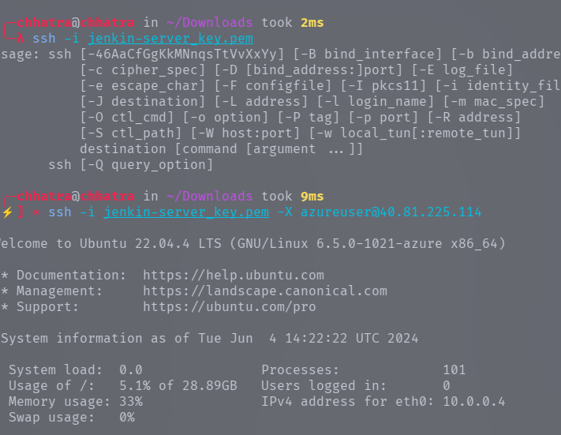
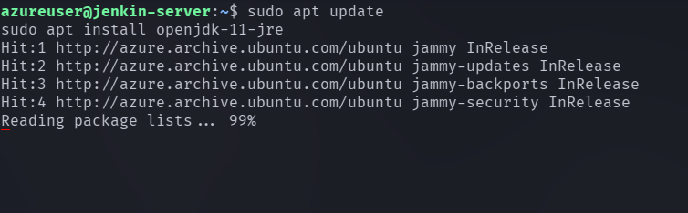
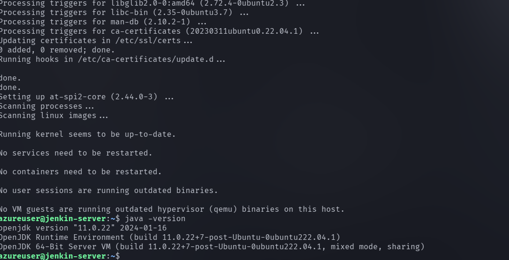
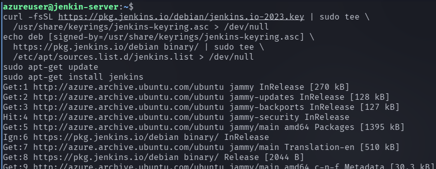
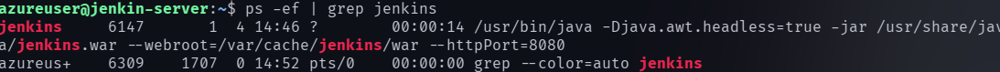
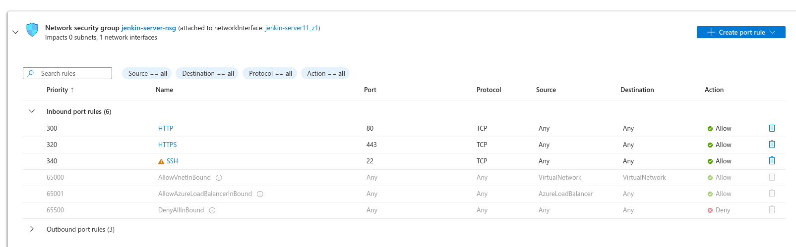
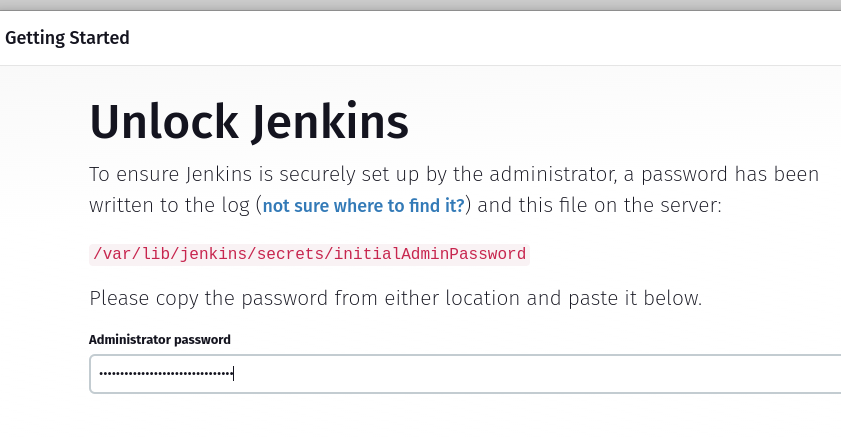
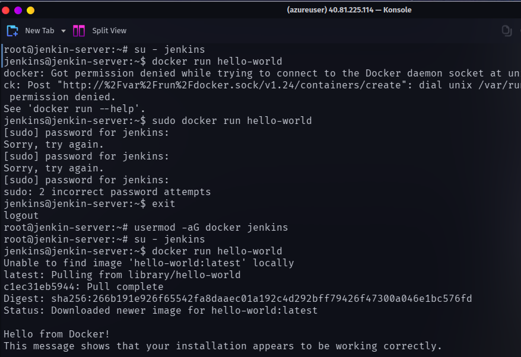

I created a azure vm first and gave it a public iP address .

Now  I will log into it using ssh.



You can go through my azure_vm folder for further instruction.

Run the below commands to install java and jenkins

```
sudo apt update
sudo apt install openjdk-11-jre
```


verify java is installed

```
java -version
```



Now you can proceed with installing jenkins

```
curl -fsSL https://pkg.jenkins.io/debian/jenkins.io-2023.key | sudo tee \
  /usr/share/keyrings/jenkins-keyring.asc > /dev/null
echo deb [signed-by=/usr/share/keyrings/jenkins-keyring.asc] \
  https://pkg.jenkins.io/debian binary/ | sudo tee \
  /etc/apt/sources.list.d/jenkins.list > /dev/null
sudo apt-get update
sudo apt-get install jenkins
```



```
ps -ef | grep jenkins
```



We can see that jenkins is running on port 8080 but if we try to access it by putting public url and port number. You won't be able to access it 


For this , go to Network settings tab.



there is no inbound traffic accepted at port 8080
so we need to add a rule.

select port 8080 and source any or your IP address if you want to access only from your laptop.



follow the instruction and setup your jenkins account.


create your first admin account.
Remember the account username and password as it will be used for all during login with your jenkins account.

Now let's use docker with jenkins so let's first install docker

```
sudo apt update
sudo apt install docker.io

```

## Install the Docker Pipeline plugin in Jenkins:

   - Log in to Jenkins.
   - Go to Manage Jenkins > Manage Plugins.
   - In the Available tab, search for "Docker Pipeline".
   - Select the plugin and click the Install button.
   - Restart Jenkins after the plugin is installed.
   


Wait for the Jenkins to be restarted.


### Grant Jenkins user and Ubuntu user permission to docker deamon.

```
sudo su - 
usermod -aG docker jenkins
usermod -aG docker ubuntu
systemctl restart docker
```

Once you are done with the above steps, it is better to restart Jenkins.

```
http://<azure-vm-instance-public-ip>:8080/restart
```

The docker agent configuration is now successful.

NOw to verify switch to jenkins user

```
su - jenkins

```


Now let's run a helloworld.

```
docker run hello-world

```



Horray , you installed jenkins successfully.

