## In this we will create our own virtual network

Step 1: First let's click on resource group click create Resource group.

Fill in the information for example I named it chhhatra_group.


Step 2 : Click on create Virtual network.
Assign it to the resource group .
Enable Bastain host and 
Enable Firewall and 
Choose a proper Ip address with appropiate CIDR.
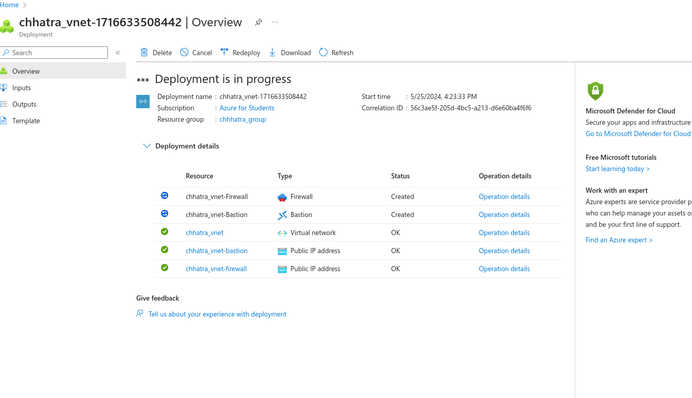

Once deployment is completed your dashboard should look something like this.

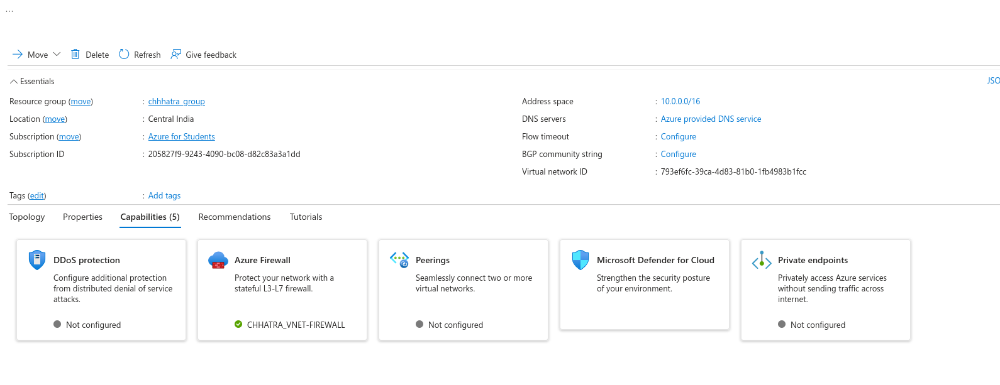

Now create a Virtual Machine 
follow similar steps [Click here](../README.md)

only difference is that you will choose the chhatra_resource group or the resource group which we have created instead of creating a new one  and assign it to one of the subnet in our virtual network.

And we won't have any public IP address for this virtual machine as we will use bastian to connect to our machine .

**Note always chose free services eligible ubuntu and B1 series machine free services eligible**

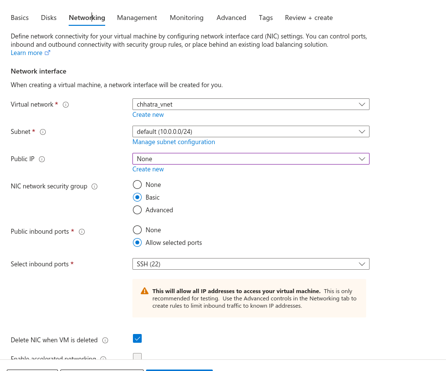

We are not assigning it any public ip address.s

Now we have the user group created , we created a virtual network with firewall and bastain host  and connect our virtual machine in the default subnet.

Go to the created a virtual machine and search 

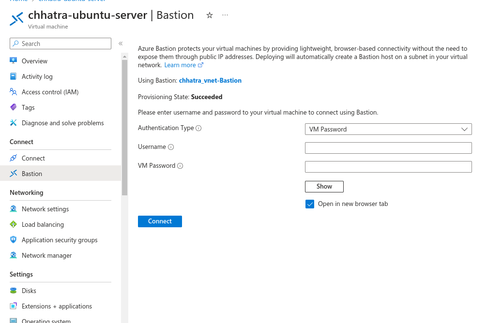

Change authentication type to ssh  private key from local

and upload the pem file from your local computer . the pem file must have been downloaded while creating vm.

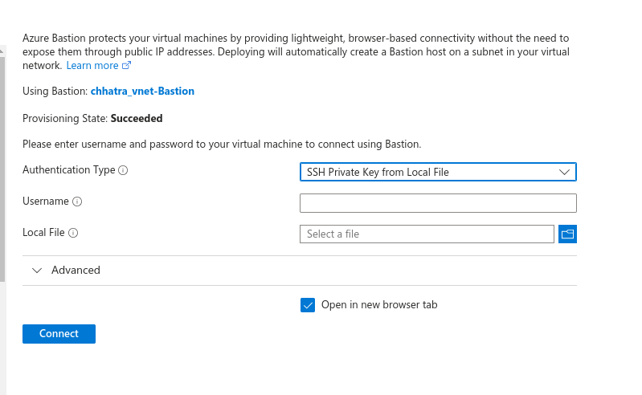

give user nmae as azureuser if you havenot changed the default while configuration.

Just search Bastian that you created and you can view access control permssion which you can edit as per your need.

Right now , we are just using bastian as a proxy to access to VM.


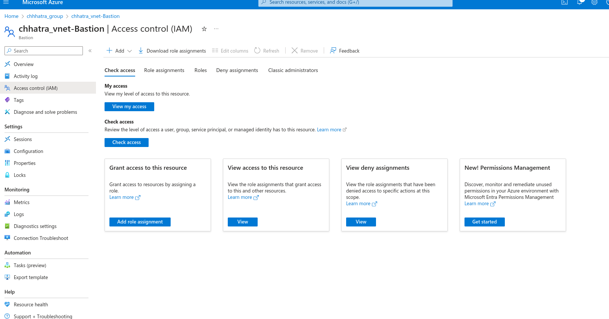


Okay now let's come back to VM 


click connect


and you should see a new tab opening like this.


Now you can run all ubuntu commands in the terminal as a normal computer 

In this example let's install nginx.

```
sudo su
apt-get update

```
You can always refer to nginx documentation for installing nginx on ubuntu.

```
apt-get install nginx -y

```

Now I want to host a static website.

```
cd /var/www/html

```

```
ls
```

```
pwd
```
Let's create a simple file named index.html

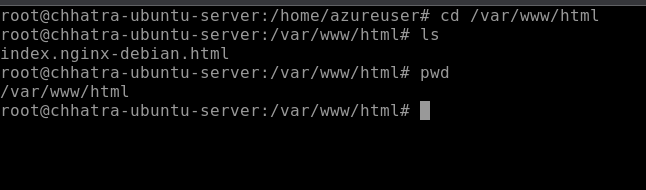

```
vim index.html
```

and then 

```
systemctl restart nginx

```

Nginx is installed in vm but the vm can't be directly accessed as it has only private subnet.

Now the only way to access it is configuring the firewall

So le't configure it.

search for firewall and open it.


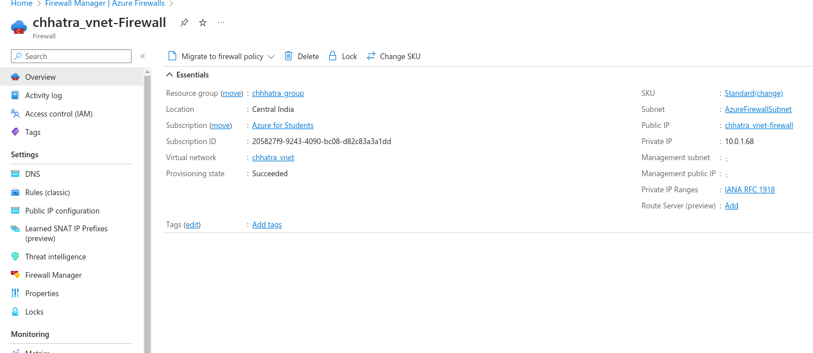

Click on firewall poclies 
and go to DNAT rules.


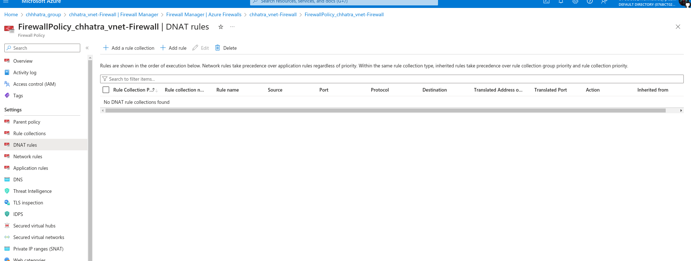


Click on ADD a rule collection

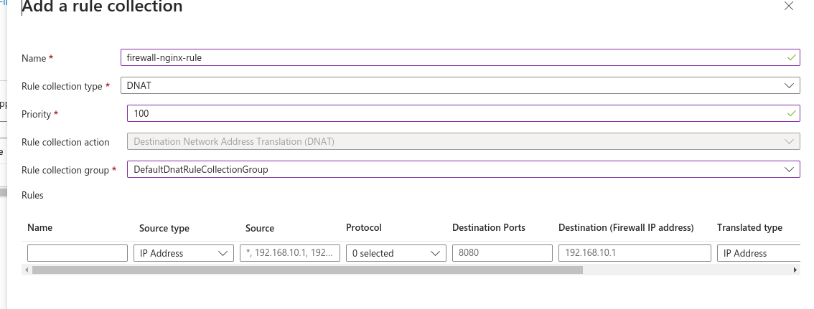

After adding a collection create a rule
source ip should be your ip address
destiantion ip the ip address of firewall
Translation type is Ip address

translated ip address is the ip address of the vm.
nginx always run on port 80 so translated port should be 80

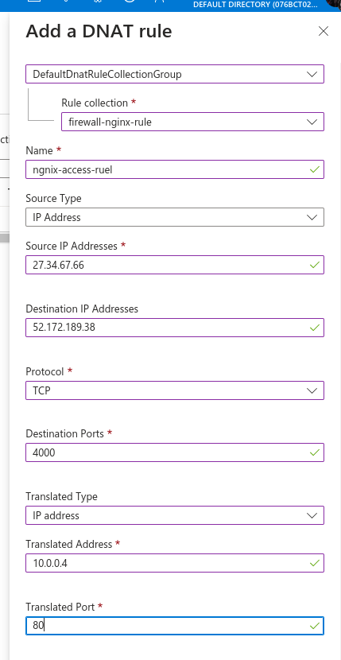

Click save

Now if you type destination address the address of the firewall and then port 4000

You should probably see this 

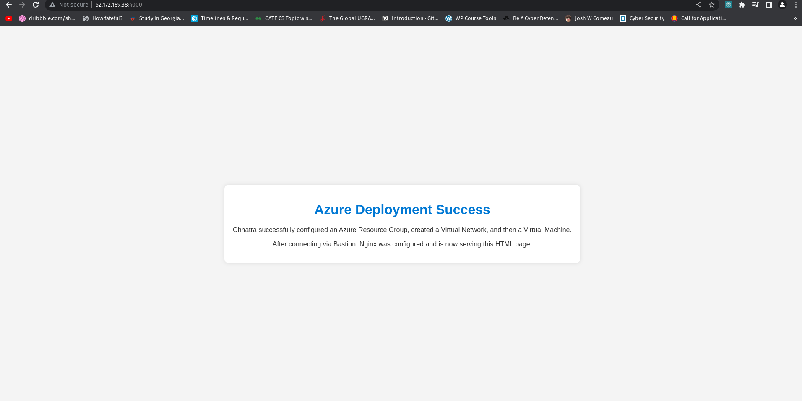

Horray we successfullly completed the task.

