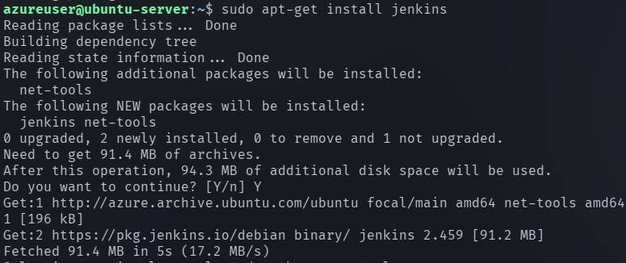

## setting up simple azure virtual machine 

#### step 1 

```
1. Go to azure portal click on Vm and then create.
```

```
2. Give appropiate values for specific fields.
like image , machine instance B1 series (free services eligible)
give permission for http, https and ssh.
```

```
3. click review and create and download the ssh file.
```


Now navigate to virtual machine a list of virtual machines will appear which will tell you which you have configured.


click on the vm and you will see a dashboard with details about the vm. 
You can have a look at some important details which are of use to us like the public ip address which we will use to connect to our azure vm.


Navigate to the directory where you have the ssh private key pem file . In my case it's download folder.

 

In default , the pem file has too open permission so it needs to give appropiate permission for the user.


You can get the public ip address by looking at dashboard of the vm.


After succesful ssh login you should see this.


You can treat this virtual machine as ubuntu machine and run any ubuntu command.

Let's install jenkins on this remote machine , (as a devops engineer we will use it lot )

### Install Jenkins.

Pre-Requisites:
 - Java (JDK)

### Run the below commands to install Java and Jenkins

Install Java

```
sudo apt update
sudo apt install openjdk-11-jre
```

Verify Java is Installed

```
java -version

```


Now, you can proceed with installing Jenkins

```
curl -fsSL https://pkg.jenkins.io/debian/jenkins.io-2023.key | sudo tee \
  /usr/share/keyrings/jenkins-keyring.asc > /dev/null
echo deb [signed-by=/usr/share/keyrings/jenkins-keyring.asc] \
  https://pkg.jenkins.io/debian binary/ | sudo tee \
  /etc/apt/sources.list.d/jenkins.list > /dev/null
sudo apt-get update
sudo apt-get install jenkins
```





**Note: ** By default, Jenkins will not be accessible to the external world due to the inbound traffic restriction by AWS. Open port 8080 in the inbound traffic rules as show below.

To verify jenkins is running or not 

```
ps -ef | grep jenkins
```


From the above output we can know that jenkins is successfully installed and running on port 8080

Now we need to go to this http://20.193.130.70:8080/  ip to view jenkins application but in cloud providers there is a concept where ports are blocked by default for obvious security corcern.

Go to the virtual machine 
Navigate to network settings


go to network settings and you will find out inbound and outbound.

Inbound : Traffic coming to your application

Outbound: Traffic going out from your application.


click on create a new inboud port rule.
create> inboud port rule.


Total ports in the router.


Now you should see something like this in the server.


