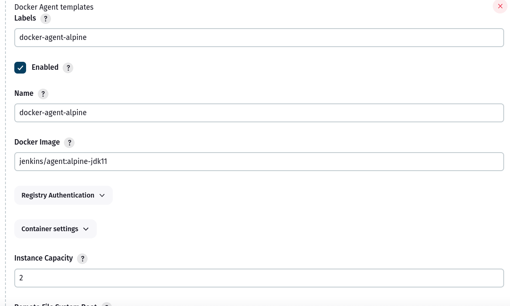

So the jenkins is running locally .

# Step 1

Go to  Jenkins plugin manager.

Install docker cloud related plugin


# step 2 :
Run the below command locally to setup container and network to be jenkins same as the jenkins container so that jenkins can comunicate with it

```
docker run -d --restart=always -p 127.0.0.1:2376:2375 --network jenkins -v /var/run/docker.sock:/var/run/docker.sock alpine/socat tcp-listen:2375,fork,reuseaddr unix-connect:/var/run/docker.sock

```

Get the IP address of the command.

```

docker inspect <container_id> | grep IPAddress
```

go to cloud configuration , select docker and then once the docker cloud is setup.


We need to create a docker agenet template.

Click on Add a Docker Template




In container settings. You can leave it as default.


