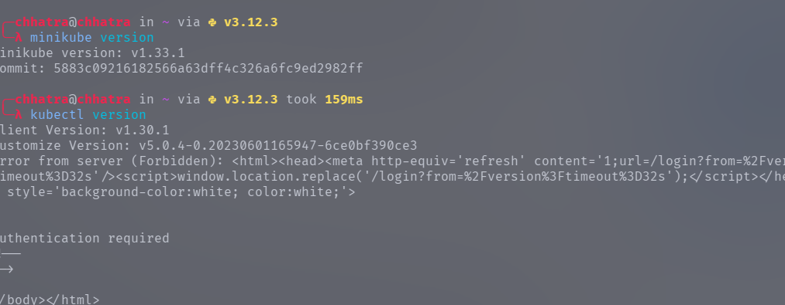
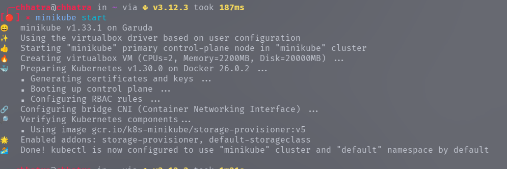
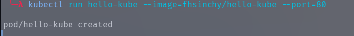
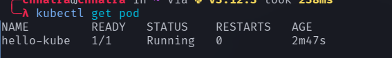
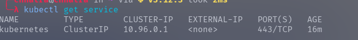
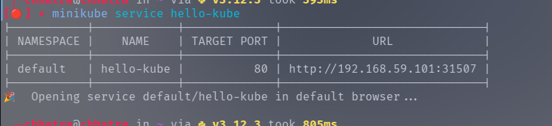
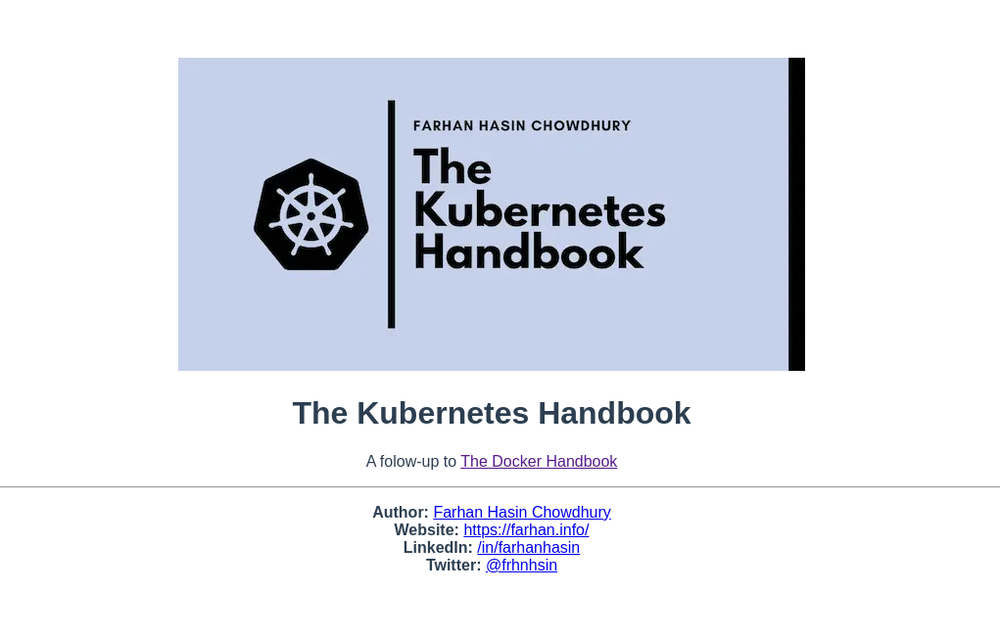

## Introduction to Container Orchestration and Kubernetes

Running Kubernetes in your local machine is actually a lot different than running Kubernetes on the cloud. To get Kubernetes up and running, you need two programs

minikube - it runs a single-node Kubernetes cluster inside a Virtual Machine (VM) on your local computer.

kubectl - The Kubernetes command-line tool, which allows you to run commands against Kubernetes clusters

I have already installed on my linux machine .




Let's start minicube.

```
minikube start
```



 Once minikube has started, execute the following command in your terminal

 ```
 kubectl run hello-kube --image=fhsinchy/hello-kube --port=80
 ```



You'll see the pod/hello-kube created message almost immediately. The run command runs the given container image inside a pod.

Pods are like a box that encapsulates a container. To make sure the pod has been created and is running, execute the following command:

```
kubectl get pod
```



To make sure the load balancer service has been created successfully, execute the following command:

```
kubectl get service
```



Make sure you see the hello-kube service in the list. Now that you have a pod running that is exposed, you can go ahead and access that. Execute the following command to do so


```
minikube service hello-kube
```



Open your browser you should see something like this.


