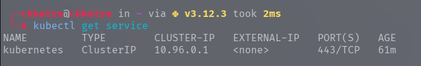
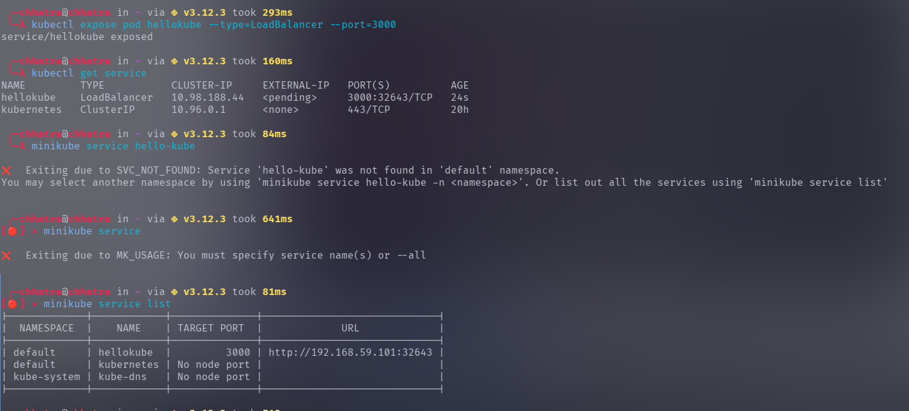
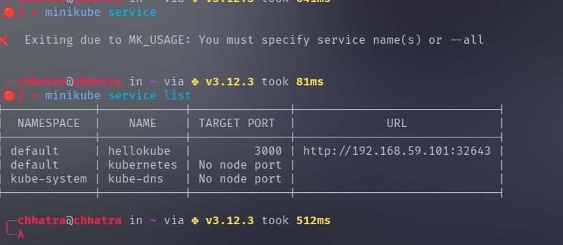
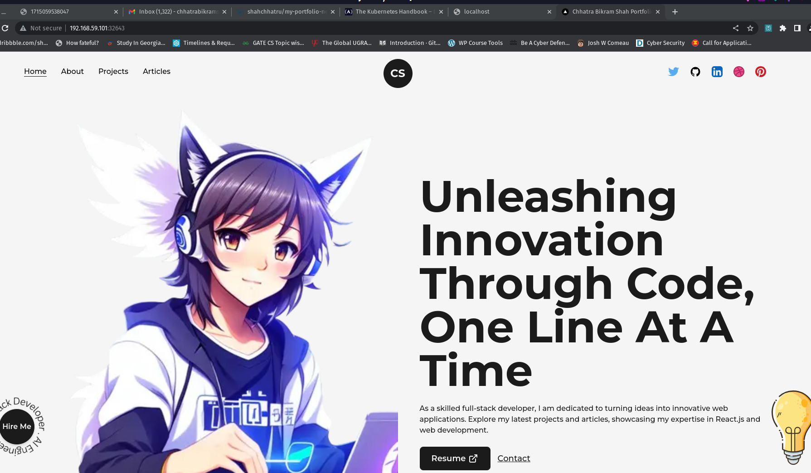

## Introduction to Container Orchestration and Kubernetes

Running Kubernetes in your local machine is actually a lot different than running Kubernetes on the cloud. To get Kubernetes up and running, you need two programs

minikube - it runs a single-node Kubernetes cluster inside a Virtual Machine (VM) on your local computer.

kubectl - The Kubernetes command-line tool, which allows you to run commands against Kubernetes clusters

I have already installed on my linux machine .


Let's start minicube.

```
minikube start
```


 Once minikube has started, execute the following command in your terminal

 ```
 kubectl run hello-kube --image=fhsinchy/hello-kube --port=80
 ```


You'll see the pod/hello-kube created message almost immediately. The run command runs the given container image inside a pod.

Pods are like a box that encapsulates a container. To make sure the pod has been created and is running, execute the following command:

```
kubectl get pod
```


To make sure the load balancer service has been created successfully, execute the following command:

```
kubectl get service
```


Make sure you see the hello-kube service in the list. Now that you have a pod running that is exposed, you can go ahead and access that. Execute the following command to do so


```
minikube service hello-kube
```


Open your browser you should see something like this.


In our local setup, minikube is a single node Kubernetes cluster. So instead of having multiple servers like in the diagram above, minikube has only one that acts as both the main server and the node.

We can run any valid container image inside a pod. The fhsinchy/hello-kube Docker image contains a very simple JavaScript application that runs on port 80 inside the container. The --port=80 option allows the pod to expose port 80 from inside the container

Now Let's get rid of the kubernetes resources :

```
kubectl delete <resource type> <resource name>
```

To delete a pod named hello-kube the command will be as follows:

```
kubectl delete pod hello-kube
```

And to delete the service named hello-kube

```
kubectl delete service hello-kube
```
After deleting the resources .
We get something like this.



IN similar way I deployed my custom website. I had push all the dependencies required and steps to build site as a docker image in the docker hub which I downloaded and ran in the k8s cluster.







Click the url shown above and you will see something like this.



